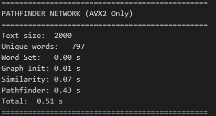
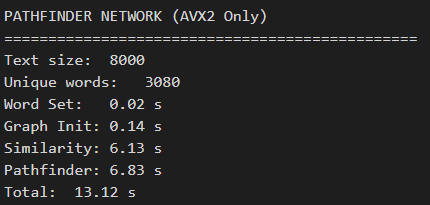
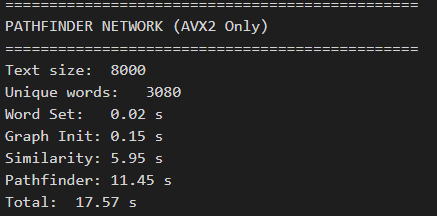

# Floyd-Warshall Algorithm Parallelization with AVX2

## Description and Parallelization Explanation

This program implements the Pathfinder Network (PFNET) algorithm, extracting key relationships between words based on their co-occurrence in an input text with the help of AVX2 intrinsics.

Algorithm Overview:

1. Builds a co-occurrence graph based on word proximity (_MAX_DISTANCE).
2. Calculates an initial distance matrix D where distance = 1 - cosine_similarity (based on co-occurrence vectors).
3. Computes all-pairs shortest paths using a modified Floyd-Warshall algorithm. Optionally uses blocking/tiling (blocked_floyd_warshall) for better cache performance during the Floyd-Warshall computation if the matrix size is divisible by the block size.

Parallelization Explanation:
The key areas vectorized using AVX2 intrinsics (_mm256_* on __m256d types) are:

1. Minkowski Distance Calculation: The avx2_minkowski_distance function is main parallelization we applied to the modified Floyd-Warshall. It uses specific AVX2 code paths for r=1, 2, infinity (add, mul/add/sqrt, max respectively) and falls back to scalar pow otherwise.
2. Floyd-Warshall Inner Loop: The `j` loop in both floyd_warshall and within the block processing of blocked_floyd_warshall is fully vectorized. This processes 4 distance updates (load, minkowski, min, store) concurrently per iteration, significantly increasing throughput. We used loadu and storeu for memory access within these loops.
3. Cosine Similarity: The dot product and vector norms calcuation is accelerated using AVX2's multiply and add function.

And as mentioned above we implemented cache blocking (blocked_floyd_warshall). This isn't parallelism itself, but a memory optimization. By processing the matrix in smaller tiles designed to fit within the L1 cache, we intend to improve data locality and allowing the vectorized loops operating on the blocks to sustain higher performance.

## Prerequisites

- PowerShell (Windows that support AVX2)

## Usage

### 1. Set-Up & Run<br>

For Windows using PowerShell

1. Compile the C file

    ```
    ./script/setup.ps1
    ```

2. Run testcase with x in range of (1 - 4)

    ```
    ./script/run.ps1 X
    ```

### Side Notes

Test cases are available in the test_case folder

## Speed Up Analysis

Testing was done on device with the following specifications

```
Asus TUF Gaming F15 Intel Core i7 - 12700H
CPU: 14 cores
GPU: 2560 CUDA cores
RAM: 16 GB
```

### Test Case 1 - Execution Time

| r   | Serial | AVX2  |
|-----|--------|------|
| r1  |    3   | 0.09 |
| r2  |    5   | 0.16 |
| inf |    6   | 0.34 |

### Test Case 1 - Speed-Up

| r   | Speed-Up |
|-----|------|
| r1  | 33 |
| r2  | 31.25 |
| inf | 17.64 |

### Test Case 2 - Execution Time

| r   | Serial | AVX2  |
|-----|--------|------|
| r1  |   15    | 0.23 |
| r2  |   15    | 0.48 |
| inf |   21    | 0.51 |

### Test Case 2 - Speed-Up

| r   | Speed-Up |
|-----|------|
| r1  | 65.21 |
| r2  | 31.25 |
| inf | 41.17 |

### Test Case 3 - Execution Time

| r   | Serial | AVX2  |
|-----|--------|------|
| r1  |   206    | 4.97 |
| r2  |   204    | 6.78 |
| inf |   270    | 9.69 |

### Test Case 3 - Speed-Up

| r   | Speed-Up |
|-----|------|
| r1  | 41.44 |
| r2  | 30.08 |
| inf | 27.86 |

### Test Case 4 - Execution Time

| r   | Serial | AVX2  |
|-----|--------|------|
| r1  |   914    | 13.12 |
| r2  |   1069    | 29.06 |
| inf |   1303    | 17.57 |

### Test Case 4 - Speed-Up

| r   | Speed-Up |
|-----|------|
| r1  | 69.66 |
| r2  | 36.78 |
| inf | 74.16 |

## Results

### Test Case 1 (case1.txt)

#### Parameter r = 1

- Serial  

  

- AVX2

  

#### Parameter r = 2

- Serial  

  

- AVX2

  

#### Parameter r = inf

- Serial  

  

- AVX2

  

### Test Case 2 (case2.txt)

#### Parameter r = 1

- Serial  

  

- AVX2

  

#### Parameter r = 2

- Serial  

  

- AVX2

  

#### Parameter r = inf

- Serial  

  

- AVX2

  

### Test Case 3 (case3.txt)

#### Parameter r = 1

- Serial  

  

- AVX2

  

#### Parameter r = 2

- Serial  

  

- AVX2

  

#### Parameter r = inf

- Serial  

  

- AVX2

  

### Test Case 4 (case4.txt)

#### Parameter r = 1

- Serial  

  

- AVX2

  

#### Parameter r = 2

- Serial  

  

- AVX2

  

#### Parameter r = inf

- Serial  

  

- AVX2

  
