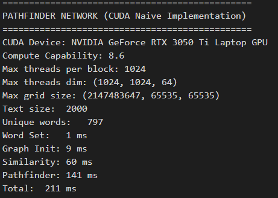

# Floyd-Warshall Algorithm Parallelization with CUDA

## Description and Parallelization Explanation

This program implements the Pathfinder Network (PFNET) algorithm using CUDA parallelization to efficiently analyze relationships between words in a text. It's designed to leverage GPU acceleration for processing large text datasets and identifying semantic patterns through graph-based analysis.

Algorithm Overview:

1. Text Processing & Graph Construction:
  Reads input words and builds a unique lexicon
  Constructs a co-occurrence graph where connections represent words appearing within a defined proximity window (_MAX_DISTANCE = 5)
  Weights graph edges based on co-occurrence frequency
2. Distance Calculation:
  Computes cosine similarity between word vectors using a CUDA kernel (cosine_similarity_kernel)
  Converts similarities to distances using the inverse relationship (distance = 1 - similarity)
3. Path Analysis:
  Implements a CUDA-accelerated Floyd-Warshall algorithm for all-pairs shortest paths
  Supports different distance metrics through the Minkowski r-parameter (Manhattan, Euclidean, or Chebyshev)
  Uses atomic operations to safely update shared distance values across threads


CUDA Implementation Highlights:

1. Parallel Cosine Similarity:
  Each thread computes similarity between a unique word pair
  Grid and block dimensions are configured to efficiently distribute computation across GPU threads
  Leverages GPU's parallel architecture for vector dot products and norm calculations
2. Optimized Floyd-Warshall:
  Uses a custom atomicMinDouble function for thread-safe minimum value updates
  Implements different distance metrics based on the r-parameter (1.0 for Manhattan, 2.0 for Euclidean, infinity for Chebyshev)
3. Memory Management:
  Synchronizes execution between kernel launches to ensure consistency
  Releases device memory appropriately to prevent leaks

This implementation demonstrates how CUDA can significantly accelerate graph algorithms and similarity computations, making it possible to analyze large text corpora efficiently. The performance measurements shown in the code (with millisecond timing for each phase) highlight the benefits of GPU parallelization for this computationally intensive task.

## Prerequisites

- PowerShell (Device that have CUDA GPU)

## Usage

### 1. Set-Up & Run<br>

For Windows using PowerShell

1. Compile the C file

    ```
    ./script/setup.ps1
    ```

2. Run testcase with x in range of (1 - 4)

    ```
    ./script/run.ps1 X
    ```

### Side Notes

Test cases are available in the test_case folder

## Speed Up Analysis

Testing was done on device with the following specifications

```
Asus TUF Gaming F15 Intel Core i7 - 12700H
CPU: 14 cores
GPU: 2560 CUDA cores
RAM: 16 GB
```

### Test Case 1 - Execution Time

| r   | Serial | CUDA  |
|-----|--------|------|
| r1  |    3   | 0.089 |
| r2  |    5   | 0.117 |
| inf |    6   | 0.096 |

### Test Case 1 - Speed-Up

| r   | Speed-Up |
|-----|------|
| r1  | 33.708 |
| r2  | 42.735 |
| inf | 62.5 |

### Test Case 2 - Execution Time

| r   | Serial | CUDA  |
|-----|--------|------|
| r1  |   15    | 0.123 |
| r2  |   15    | 0.211 |
| inf |   21    | 0.147 |

### Test Case 2 - Speed-Up

| r   | Speed-Up |
|-----|------|
| r1  | 121.951 |
| r2  | 71.090 |
| inf | 142.857 |

### Test Case 3 - Execution Time

| r   | Serial | CUDA  |
|-----|--------|------|
| r1  |   206    | 0.862 |
| r2  |   204    | 1.816 |
| inf |   270    | 1.078 |

### Test Case 3 - Speed-Up

| r   | Speed-Up |
|-----|------|
| r1  | 238.979 |
| r2  | 112.339 |
| inf | 250.464 |

### Test Case 4 - Execution Time

| r   | Serial | CUDA  |
|-----|--------|------|
| r1  |   914    | 3.222 |
| r2  |   1069    | 7.485 |
| inf |   1303    | 4.172 |

### Test Case 4 - Speed-Up

| r   | Speed-Up |
|-----|------|
| r1  | 283.675 |
| r2  | 142.819 |
| inf | 312.320 |

## Results

### Test Case 1 (case1.txt)

#### Parameter r = 1

- Serial  

  

- CUDA

  

#### Parameter r = 2

- Serial  

  

- CUDA

  

#### Parameter r = inf

- Serial  

  

- CUDA

  

### Test Case 2 (case2.txt)

#### Parameter r = 1

- Serial  

  

- CUDA

  

#### Parameter r = 2

- Serial  

  

- CUDA

  

#### Parameter r = inf

- Serial  

  

- CUDA

  

### Test Case 3 (case3.txt)

#### Parameter r = 1

- Serial  

  

- CUDA

  

#### Parameter r = 2

- Serial  

  

- CUDA

  

#### Parameter r = inf

- Serial  

  

- CUDA

  

### Test Case 4 (case4.txt)

#### Parameter r = 1

- Serial  

  

- CUDA

  

#### Parameter r = 2

- Serial  

  

- CUDA

  

#### Parameter r = inf

- Serial  

  

- CUDA

  
