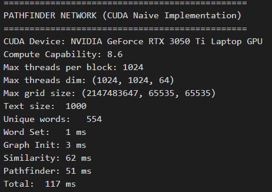

# Floyd-Warshall Algorithm Parallelization with CUDA

## Description and Parallelization Explanation

DESC

## Prerequisites

- PowerShell (Device that have CUDA GPU)

## Usage

### 1. Set-Up & Run<br>

For Windows using PowerShell

1. Compile the C file

    ```
    ./script/setup.ps1
    ```

2. Run testcase with x in range of (1 - 4)

    ```
    ./script/run.ps1 X
    ```

### Side Notes

Test cases are available in the test_case folder

## Speed Up Analysis

Testing was done on device with the following specifications

```
Asus TUF Gaming F15 Intel Core i7 - 12700H
CPU: 14 cores
GPU: 2560 CUDA cores
RAM: 16 GB
```

### Test Case 1 - Execution Time

| r   | Serial | CUDA  |
|-----|--------|------|
| r1  |    3   | 0.087 |
| r2  |    5   | 0.116 |
| inf |    6   | 0.096 |

### Test Case 1 - Speed-Up

| r   | Speed-Up |
|-----|------|
| r1  | 34.483 |
| r2  | 43.103 |
| inf | 62.5 |

### Test Case 2 - Execution Time

| r   | Serial | CUDA  |
|-----|--------|------|
| r1  |   15    | 0.125 |
| r2  |   15    | 0.210 |
| inf |   21    | 0.140 |

### Test Case 2 - Speed-Up

| r   | Speed-Up |
|-----|------|
| r1  | 120 |
| r2  | 71.429 |
| inf | 150 |

### Test Case 3 - Execution Time

| r   | Serial | CUDA  |
|-----|--------|------|
| r1  |   206    | 0.862 |
| r2  |   204    | 1.816 |
| inf |   270    | 1.078 |

### Test Case 3 - Speed-Up

| r   | Speed-Up |
|-----|------|
| r1  | 238.979 |
| r2  | 112.339 |
| inf | 250.464 |

### Test Case 4 - Execution Time

| r   | Serial | CUDA  |
|-----|--------|------|
| r1  |   914    | 3.222 |
| r2  |   1069    | 7.485 |
| inf |   1303    | 4.172 |

### Test Case 4 - Speed-Up

| r   | Speed-Up |
|-----|------|
| r1  | 283.675 |
| r2  | 142.819 |
| inf | 312.320 |

## Results

### Test Case 1 (case1.txt)

#### Parameter r = 1

- Serial  

  

- CUDA

  

#### Parameter r = 2

- Serial  

  

- CUDA

  

#### Parameter r = inf

- Serial  

  

- CUDA

  

### Test Case 2 (case2.txt)

#### Parameter r = 1

- Serial  

  

- CUDA

  

#### Parameter r = 2

- Serial  

  

- CUDA

  

#### Parameter r = inf

- Serial  

  

- CUDA

  

### Test Case 3 (case3.txt)

#### Parameter r = 1

- Serial  

  

- CUDA

  

#### Parameter r = 2

- Serial  

  

- CUDA

  

#### Parameter r = inf

- Serial  

  

- CUDA

  

### Test Case 4 (case4.txt)

#### Parameter r = 1

- Serial  

  

- CUDA

  

#### Parameter r = 2

- Serial  

  

- CUDA

  

#### Parameter r = inf

- Serial  

  

- CUDA

  
