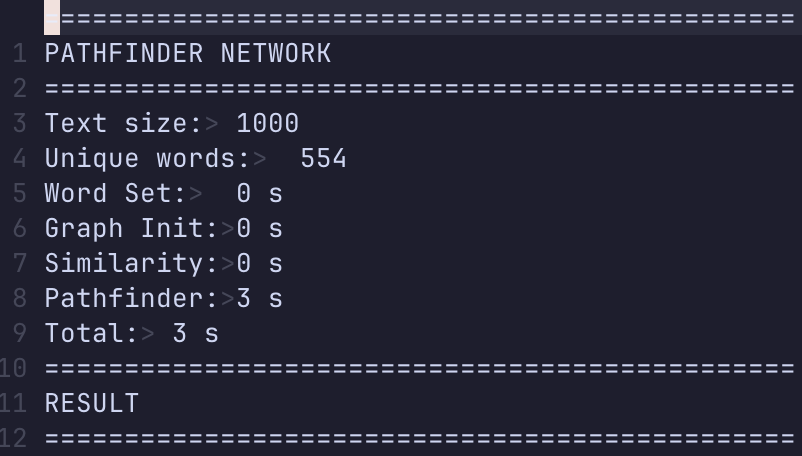
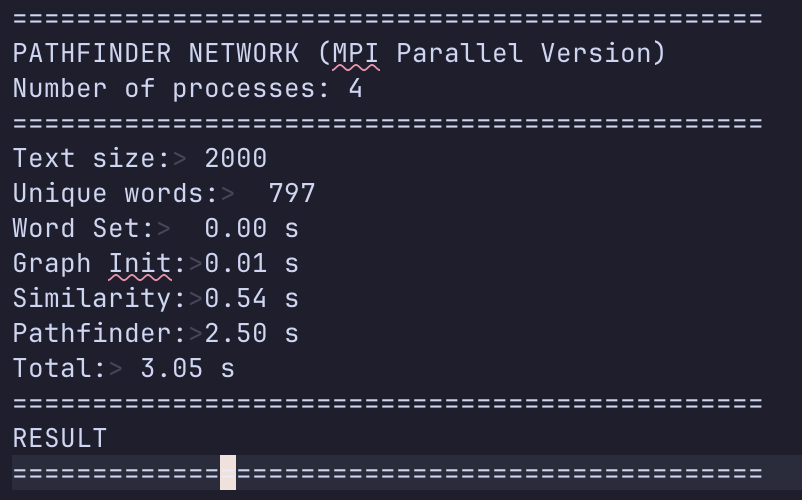
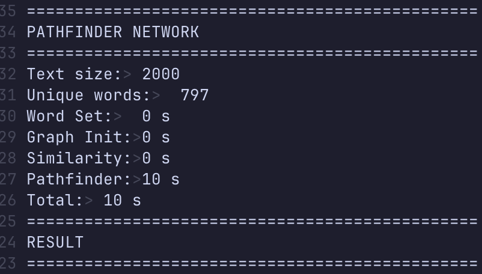
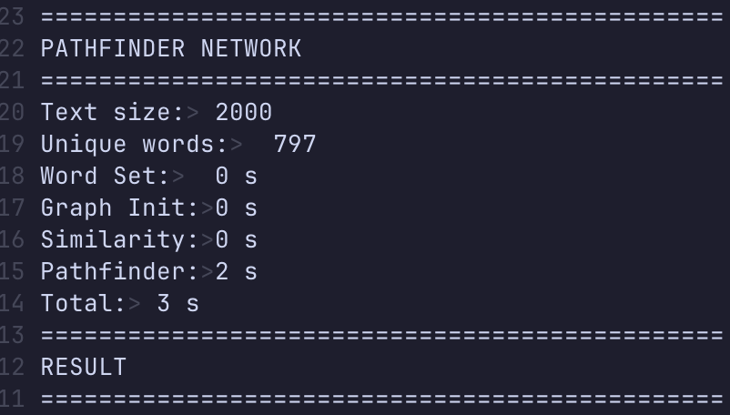
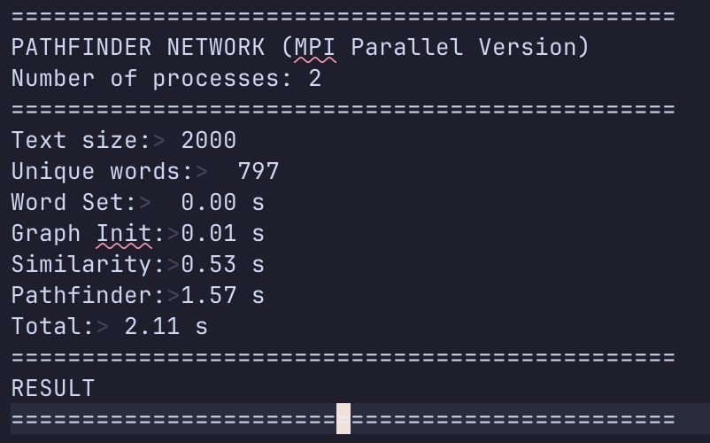
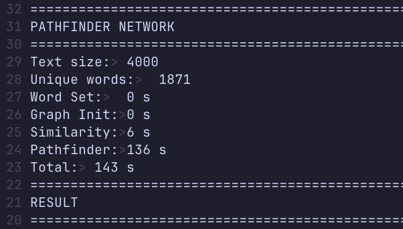
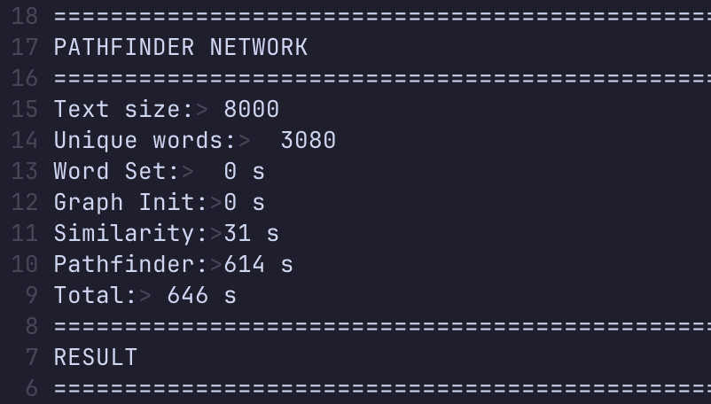

# Floyd-Warshall Algorithm Parallelization with Open MPI

## Description and Parallelization Explanation

This program parallelize the Floyd-Warshall algorithm in a path-finding problem using Open MPI. The program first calls MPI_Init to initialize MPI and so that each process can know it's rank and the total process. The program is designed so that only process with rank 0 may accept the input and initialize the graph. After that, the program will broadcast the graph to all processes using MPI_Bcast. The parallelization of the Floyd-Warshall algorithm is done by dividing the graph's row into almost equal parts (almost because the modulo of row and number of process might be unequal) for all processes. This is done within the floyd_warshall procedure with this step:

1. Get the number of rows to be processed for a process (including remainder distribution)
2. Get the start and final index of the graph to be calculated by the current process
3. Each process: calculate the distance between nodes in the graph from start to final index
4. If current process's rank is 0, receive the result from all processes using MPI_Recv
5. If current process's rank is not 0, send the process's result to process with rank 0

After process with rank 0 finished calculating it's own part and other processes are done sending their results, process with rank 0 will show the final result.

## Prerequisites

- Docker
- Terminal (MacOS/Linux) or PowerShell (Windows)

## Usage

### 1. Build the Docker Image

```
docker build -t openmpi-cluster .
```

### 2. Set-Up & Run<br>

For MacOS/Linux

```
chmod +x /script/setup.sh
chmod +x /script/run.sh

./script/setup.sh <numofnodes>
./script/run.sh <numofnodes> <test_case>
```

For Windows (using PowerShell)

```
./script/setup.ps1 <numofnodes>
./script/run.ps1 <numofnodes> <test_case>
```

### Side Note

Test cases are available in the test_case folder

## Speed Up Analysis

### Test Case 1 - Execution Time

| r   | Serial | n=2  | n=4  | n=8  |
|-----|--------|------|------|------|
| r1  | 3      | 1.63 | 1.07 | 2.04 |
| r2  | 3      | 1.66 | 1.07 | 2.07 |
| inf | 1      | 0.74 | 0.58 | 1.06 |

### Test Case 1 - Speed-Up

| r   | n=2  | n=4  | n=8  |
|-----|------|------|------|
| r1  | 1.840490798 | 2.803738318 | 1.470588235 |
| r2  | 1.807228916 | 2.803738318 | 1.449275362 |
| inf | 1.351351351 | 1.724137931 | 0.9433962264 |

---

### Test Case 2 - Execution Time

| r   | Serial | n=2  | n=4  | n=8  |
|-----|--------|------|------|------|
| r1  | 10     | 4.83 | 3.05 | 5.9  |
| r2  | 10     | 5.01 | 3.26 | 6.48 |
| inf | 3      | 2.11 | 1.62 | 3.01 |

### Test Case 2 - Speed-Up

| r   | n=2  | n=4  | n=8  |
|-----|------|------|------|
| r1  | 2.070393375 | 3.278688525 | 1.694915254 |
| r2  | 1.996007984 | 3.067484663 | 1.543209877 |
| inf | 1.421800948 | 1.851851852 | 0.9966777409 |

---

### Test Case 3 - Execution Time

| r   | Serial | n=2   | n=4   | n=8   |
|-----|--------|-------|-------|-------|
| r1  | 144    | 65.89 | 43.07 | 56.22 |
| r2  | 143    | 66    | 42.79 | 55.99 |
| inf | 41     | 27.5  | 21.54 | 30.75 |

### Test Case 3 - Speed-Up

| r   | n=2  | n=4  | n=8  |
|-----|------|------|------|
| r1  | 2.185460616 | 3.343394474 | 2.561366062 |
| r2  | 2.166666667 | 3.341902314 | 2.554027505 |
| inf | 1.490909091 | 1.903435469 | 1.333333333 |

---

### Test Case 4 - Execution Time

| r   | Serial | n=2   | n=4   | n=8   |
|-----|--------|-------|-------|-------|
| r1  | 647    | 289.28 | 182.96 | 203.4  |
| r2  | 646    | 287.38 | 180.56 | 206.59 |
| inf | 185    | 122.5  | 94.82  | 122.13 |

### Test Case 4 - Speed-Up

| r   | n=2  | n=4  | n=8  |
|-----|------|------|------|
| r1  | 2.236587389 | 1.581110625 | 0.8995083579 |
| r2  | 2.247894773 | 1.591603899 | 0.8740016458 |
| inf | 1.510204082 | 1.291921536 | 0.7763858184 |

## Results

### Test Case 1 (case1.txt)

#### Parameter r = 1

- Serial  

  

- Open MPI with 2 processes  

  

- Open MPI with 4 processes  

  

- Open MPI with 8 processes  

  

#### Parameter r = 2

- Serial  

  

- Open MPI with 2 processes  

  

- Open MPI with 4 processes  

  

- Open MPI with 8 processes  

  

#### Parameter r = inf

- Serial  

  

- Open MPI with 2 processes  

  

- Open MPI with 4 processes  

  

- Open MPI with 8 processes  

  

### Test Case 2 (case2.txt)

#### Parameter r = 1

- Serial  

  

- Open MPI with 2 processes  

  

- Open MPI with 4 processes  

  

- Open MPI with 8 processes  

  

#### Parameter r = 2

- Serial  

  

- Open MPI with 2 processes  

  

- Open MPI with 4 processes  

  

- Open MPI with 8 processes  

  

#### Parameter r = inf

- Serial  

  

- Open MPI with 2 processes  

  

- Open MPI with 4 processes  

  

- Open MPI with 8 processes  

  

### Test Case 3 (case3.txt)

#### Parameter r = 1

- Serial  

  

- Open MPI with 2 processes  

  

- Open MPI with 4 processes  

  

- Open MPI with 8 processes  

  

#### Parameter r = 2

- Serial  

  

- Open MPI with 2 processes  

  

- Open MPI with 4 processes  

  

- Open MPI with 8 processes  

  

#### Parameter r = inf

- Serial  

  

- Open MPI with 2 processes  

  

- Open MPI with 4 processes  

  

- Open MPI with 8 processes  

  

### Test Case 4 (case4.txt)

#### Parameter r = 1

- Serial  

  

- Open MPI with 2 processes  

  

- Open MPI with 4 processes  

  

- Open MPI with 8 processes  

  

#### Parameter r = 2

- Serial  

  

- Open MPI with 2 processes  

  

- Open MPI with 4 processes  

  

- Open MPI with 8 processes  

  

#### Parameter r = inf

- Serial  

  

- Open MPI with 2 processes  

  

- Open MPI with 4 processes  

  

- Open MPI with 8 processes  

  
