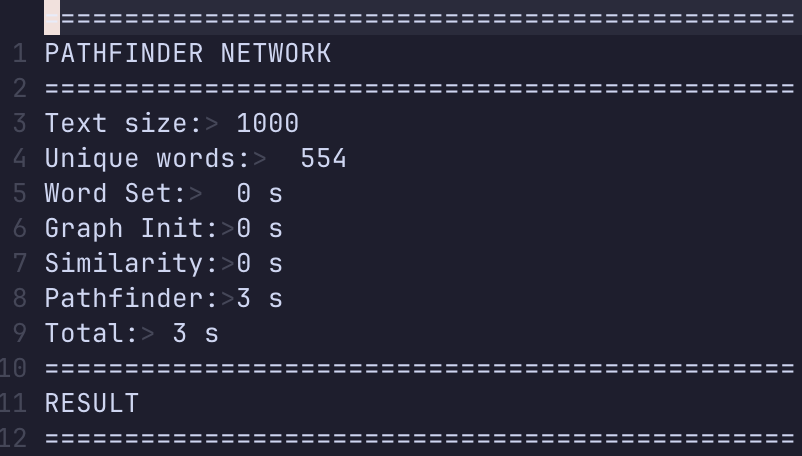
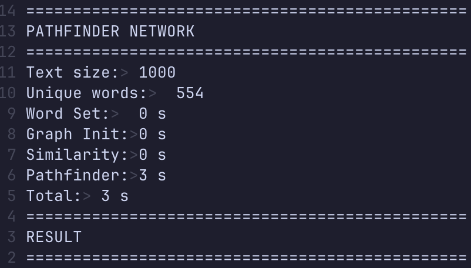
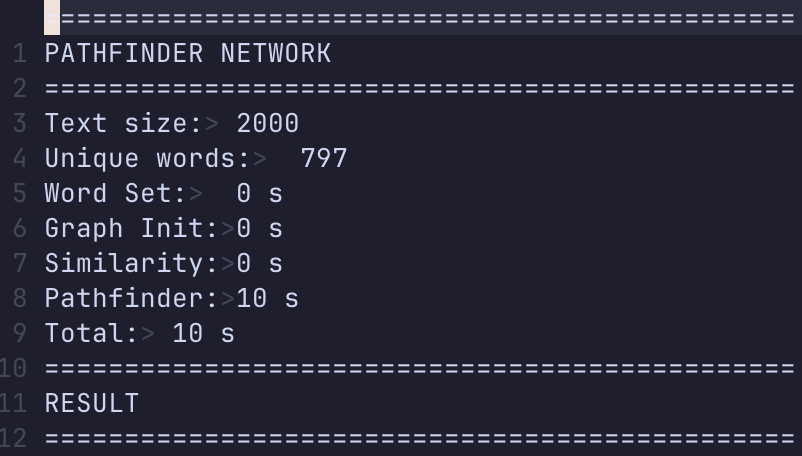
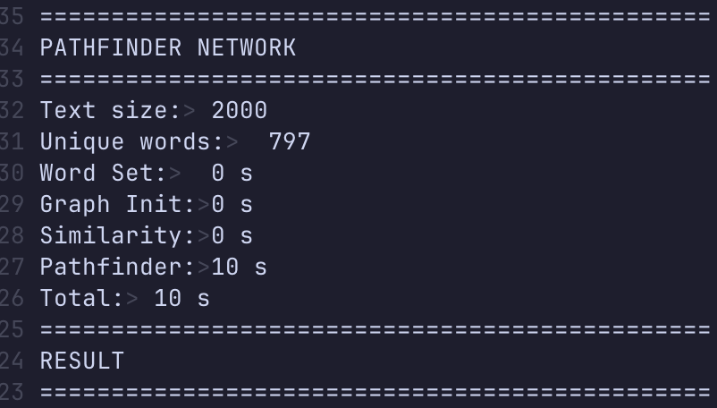
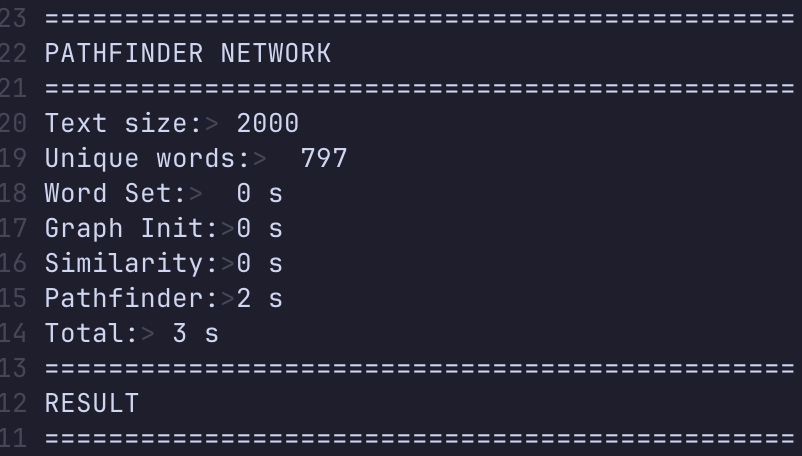
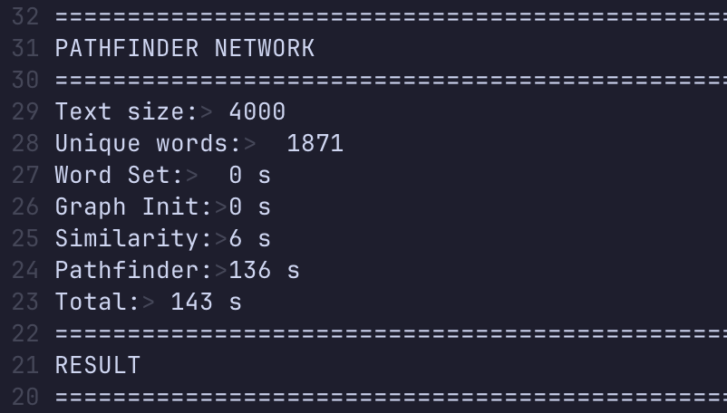
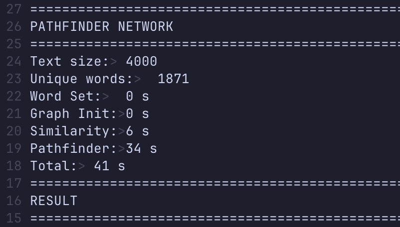
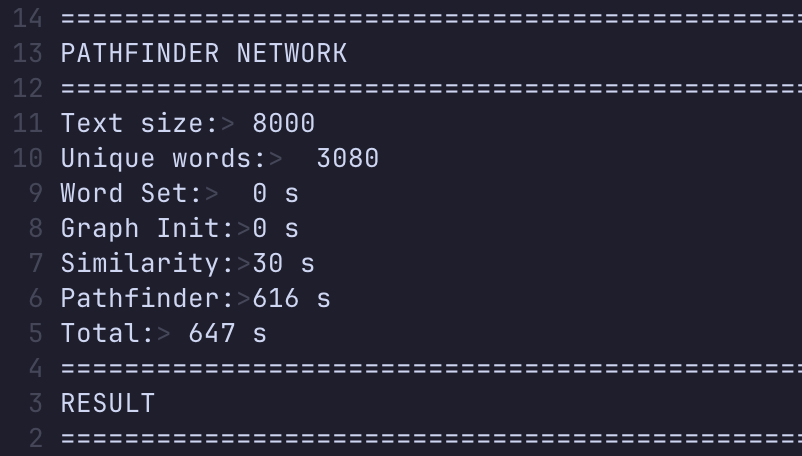
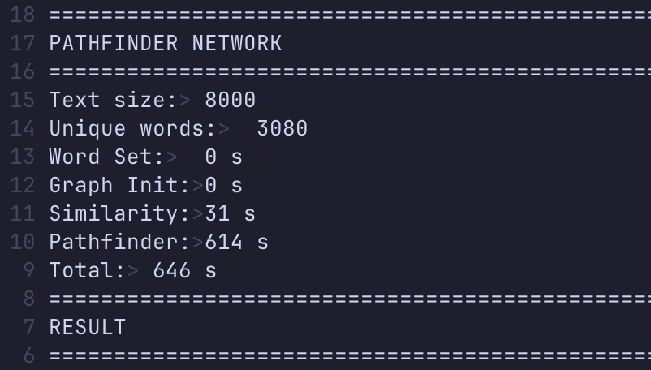
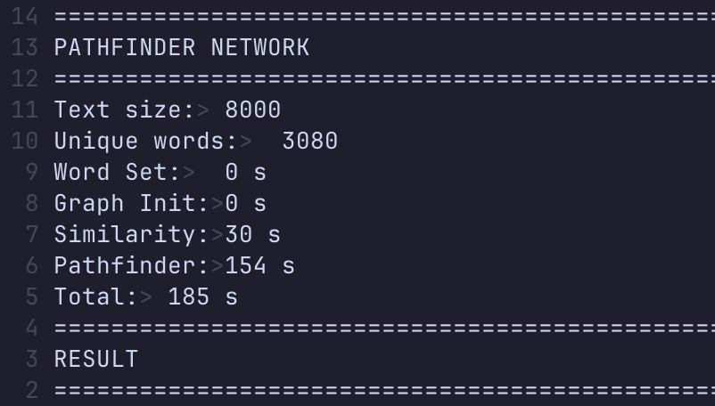

# Floyd-Warshall Algorithm Parallelization with OpenMP

## Description and Parallelization Explanation

This program parallelize the Variant of Floyd-Warshall algorithm, Blocked Floyd-Warshall algorithm in a path-finding problem using Open MP. This algorithm will use the Parallel Floyd-Warshall if maxtrix size is not possible for division. This program also utilizes the maximum amount of thread the user's PC has. These are the steps of this parallelization:

1. Initialization: The graph is put in matrix D, the minkowski distance metric is put in r.
2. Block size decision: Program calculate block size to fit L1 cache. If the number of nodes in the graph (n) is divisible by the block size, the program will use blocked_floyd_warshall. Otherwise, the program will use floyd_warshall (parallel).
3. Parallel Floyd-Warshall: When n is not divisible by the block size, the program will run OpenMP's directive for nested loop parallelization, which is #pragma omp parallel for collapse(2) with 2 meaning there are 2 loops to be parallelized.
4. Blocked Floyd-Warshall: When n is divisible by the block size, the program will run these three parts:
   - Phase 1 (Dependent Phase): This part processes the diagonal block and is not parallelized due to its data dependenc
   - Phase 2 (Partially-Dependent Phase): This part is parallelized in which all blocks in the same row and column as the current k_block are updated.
   - Phase 3 (Independent Phase): This part is parallelized in which the rest of the blocks (not the in the same row and columns as k_block) are updated.
5. Final update: After the Blocked/Parallel Floyd-Warshall is completed, the program will perform a final update to check whether or not there are any shorter paths from the original graph to the updated graph (D).

## Prerequisites
- Terminal (MacOS/Linux) or PowerShell (Windows)

## Usage

### 1. Set-Up & Run<br>
For MacOS/Linux
```
ON PROGRESS
```
For Windows using PowerShell
1. Compile the C file (open mp should already included in MSVC)
    ```
    ./script/setup.ps1
    ```
2. Run testcase with x in range of (1 - 4)
    ```
    ./script/run.ps1 X
    ```

### Side Notes

Test cases are available in the test_case folder

## Speed Up Analysis

Testing was done on device with the following specifications
```
Macbook Pro M4 chip
CPU: 10 core (4 performance, 6 efficiency)
GPU: 10 core
RAM: 16 GB
```

### Test Case 1 - Execution Time

| r   | Serial | 10 core  |
|-----|--------|------|
| r1  |    3   | X |
| r2  |    3   | X |
| inf |    1   | X |

### Test Case 1 - Speed-Up

| r   | 10 core |
|-----|------|
| r1  | X |
| r2  | X |
| inf | X |

### Test Case 2 - Execution Time

| r   | Serial | 10 core  |
|-----|--------|------|
| r1  |    10   | X |
| r2  |    10   | X |
| inf |    3   | X |

### Test Case 2 - Speed-Up

| r   | 10 core |
|-----|------|
| r1  | X |
| r2  | X |
| inf | X |

### Test Case 3 - Execution Time

| r   | Serial | 10 core  |
|-----|--------|------|
| r1  |    144   | X |
| r2  |    143   | X |
| inf |    41   | X |

### Test Case 3 - Speed-Up

| r   | 10 core |
|-----|------|
| r1  | X |
| r2  | X |
| inf | X |

### Test Case 4 - Execution Time

| r   | Serial | 10 core  |
|-----|--------|------|
| r1  |    647   | X |
| r2  |    646   | X |
| inf |    185   | X |

### Test Case 4 - Speed-Up

| r   | 10 core |
|-----|------|
| r1  | X |
| r2  | X |
| inf | X |


## Results

### Test Case 1 (case1.txt)

#### Parameter r = 1

- Serial  

  

- OpenMP

  

#### Parameter r = 2

- Serial  

  

- OpenMP 

  

#### Parameter r = inf

- Serial  

  

- OpenMP 

  

### Test Case 2 (case2.txt)

#### Parameter r = 1

- Serial  

  

- OpenMP

  

#### Parameter r = 2

- Serial  

  

- OpenMP 

  

#### Parameter r = inf

- Serial  

  

- OpenMP 

  

### Test Case 3 (case3.txt)

#### Parameter r = 1

- Serial  

  

- OpenMP

  

#### Parameter r = 2

- Serial  

  

- OpenMP 

  

#### Parameter r = inf

- Serial  

  

- OpenMP 

  

### Test Case 4 (case4.txt)

#### Parameter r = 1

- Serial  

  

- OpenMP

  

#### Parameter r = 2

- Serial  

  

- OpenMP 

  

#### Parameter r = inf

- Serial  

  

- OpenMP 

  